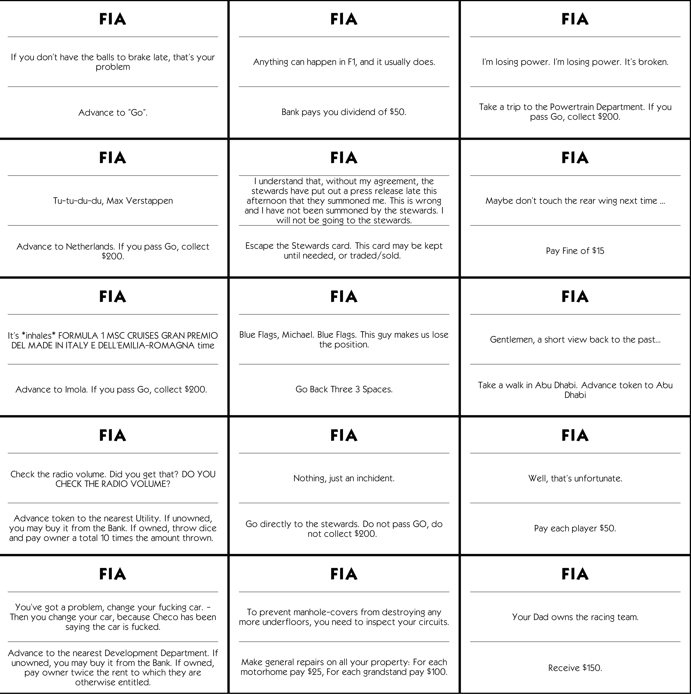

# Custom Latex monopoly
Build a custom monopoly game with these latex files.

This repository contains latex files for 
- map tiles, cards (streets, utility, railstations, community/chance)
- scripts to export the latex pdf to images and generate a map from the map tiles

## Building
To build the latex files you need the original monopoly font: Kabel Bold and Regular and use xelatex for compiling

After building a pdf file, you may extract a png file using `python crop_pdf.py input.pdf output.<pdf/png>`, which crops the pdf to its contents and saves the result.

Using the cropped result from `map.tex` the monopoly board can be generated with `python img_to_map.py tiles.png output.png` (and further customized with background color and image).

## Structure
├── `cardCommands.tex`: contains the basic commands for the creation of cards  
│&emsp;&emsp;├── `cards.tex`: contains the cards the players get  
│&emsp;&emsp;└── `chance.tex`: contains the chance front cards  
│&emsp;&emsp;└── `chance_back.tex`: contains the chance back card  
│&emsp;&emsp;└── `community.tex`: contains the community front cards  
│&emsp;&emsp;└── `community_back.tex`: contains the community back card  
├── `mapTiles.tex`: contains the basic commands for the creation of map tiles  
│&emsp;&emsp;├── `map.tex`: contains the actual creation of map tiles  

## Outputs
<table width="100%">
  <tr>
  <td width="33%" style="text-align: center; vertical-align: middle;"> Chance</td>
  <td width="33%"style="text-align: center; vertical-align: middle;"> Community</td>
  <td width="33%"style="text-align: center; vertical-align: middle;"> Cards</td>
  </tr>
  <tr>
  <td width="33%"style="text-align: center; vertical-align: middle;"> Chance Back</td>
  <td width="33%"style="text-align: center; vertical-align: middle;"> Community Back</td>
  <td width="33%"style="text-align: center; vertical-align: middle;"> Cards Back</td>
  </tr>
</table>

## Example F1 Board
